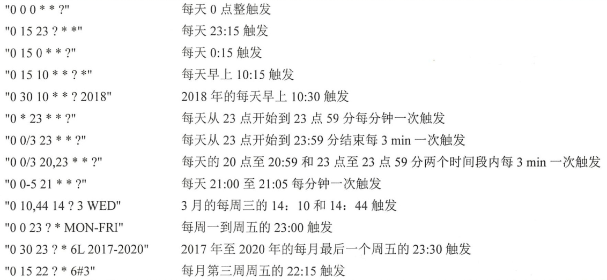

使用步骤：

1. 在启动类中标注`@EnableScheduling`
2. 创建定时任务类，加入容器中
3. 直接启动SpringBoot工程

`@Scheduled`的配置项：

| 配置项             | 类型   | 描述                                                         |
| ------------------ | ------ | ------------------------------------------------------------ |
| cron               | String | 使用表达式的方式定义任务执行时间                             |
| zone               | String | 可以通过它设定区域时间                                       |
| fixedDelay         | long   | 从上一个任务完成到下一个任务开始的间隔，单位为毫秒           |
| fixedDelayString   | String | 与fixedDelay相同，只是使用字符串，这样可以使用SpEL来引入配置文件的配置 |
| initialDelay       | long   | 在Spring loC容器完成初始化后，首次任务执行延迟时间，单位为毫秒 |
| initialDelayString | String | 与initialDelay相同，只是使用字符串，这样可以使用SpEL来引入配置文件的配置 |
| fixedRate          | long   | 从上一个任务开始到下一个任务开始的间隔，单位为毫秒           |
| fixedRateString    | String | 与fixedRate相同，是使用字符串，这样可以使用SpEL来引入配置文件的配置 |

除了cron外都比较好理解，cron是可以通过表达式更为灵活地配置运行的方式。cron有6~7个空格分隔的时间元素，按顺序依次是“秒 分 时 天 月 星期 年”，其中年是一个可以不配置的元素，例如下面的配置：

​							0 0 0 ? * WED

这个配置表示每个星期三中午0点整。这个表达式需要注意的是其中的特殊字符`?`和`*`，这里因为天和星期会产生定义上的冲突，所以往往会以通配符`?`表示，它表示不指定值，而`*`则表示任意的月。

通配符：

| 通配符 | 描述                                 |
| ------ | ------------------------------------ |
| *      | 任意值                               |
| ?      | 不指定值，用于处理天和星期配置的冲突 |
| -      | 指定时间区间                         |
| /      | 指定时间间隔执行                     |
| L      | 最后的                               |
| #      | 第几个                               |
| ,      | 列举多个项                           |

举例如下：

