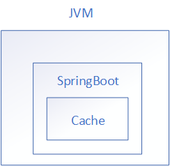
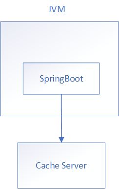
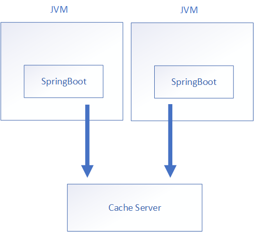
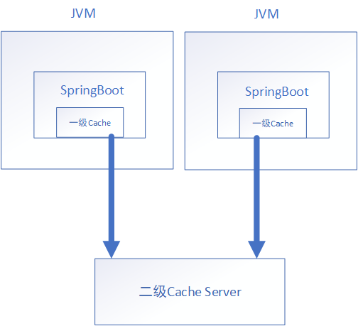

* [Cache](#cache)
  * [Cache相关概念](#cache相关概念)
  * [Cache的单体应用](#cache的单体应用)
  * [Cache的分布式应用](#cache的分布式应用)
    * [使用专用Cache服务器](#使用专用cache服务器)
    * [使用一二级缓存服务器](#使用一二级缓存服务器)
  * [SpringBoot的Cache](#springboot的cache)
  * [缓存注解](#缓存注解)
    * [@Cacheable](#cacheable)
    * [@CachePut](#cacheput)
    * [@CacheEvict](#cacheevict)
    * [@Caching](#caching)
    * [@CacheConfig](#cacheconfig)
  * [测试](#测试)
    * [测试@Cacheable](#测试cacheable)
    * [测试@CachePut](#测试cacheput)
    * [测试@CacheEvit](#测试cacheevit)


# Cache

## Cache相关概念

- CacheManager，用来创建、管理、管理多个命名唯一的Cache，如组织机构缓存、菜单项的缓存、菜单树的缓存等。
- Cache类似Map那样的Key-Value存储结构，Value部分通常包含了缓存的对象，通过Key来取得缓存对象。
- 缓存项，存放在缓存里的对象，常常需要实现序列化接口，以支持分布式缓存。
- Cache存储方式，缓存组件可以将对象放到内存或其他缓存服务器上，SpringBoot提供了一个基于`ConcurrentMap`的缓存，同时也集成了Redis、EhCache 2.x、JCache缓存服务器等。
- 缓存策略，通常Cache还可以有不同的缓存策略，如设置缓存最大的容量，缓存项的过期时间等。
- 分布式缓存，缓存通常按照缓存数据类型存放在不同缓存服务器上，或者同一类型的缓存按照某种算法、不同Key的数据存放在不同的缓存服务器上。
- Cache Hit，从Cache中取得期望的缓存项，我们通常称之为缓存命中。如果没有命中则称之为Cache Miss，意味着需要从数据来源处重新取出并放回Cache中。
- Cache Miss，缓存丢失，根据Key没有从缓存中找到对应的缓存项。
- Cache Evication，缓存清除操作。
- Hot Data，热点数据，缓存系统能调整算法或者内部存储方式，使得最有可能频繁访问的数据能被尽快访问到。
- On-Heap，Java分配对象都是在堆内存中，有最快的获取速度。由于虚拟机的垃圾回收管理机制，缓存放入过多的对象会导致垃圾回收时间过长，从而有可能影响性能。
- off-Heap，堆外内存，对象存放在虚拟机分配的堆外内存中，因此不受垃圾回收管理机制的管理，不影响系统性能，但堆外内存的对象要被使用，还要序列化成堆内对象。

很多缓存工具会把不常用的对象放到堆外，把热点数据放到堆内。


## Cache的单体应用

单体应用中，Cache可以与应用系统位于一个虚拟机中，这样的好处是访问速度最快。如果缓存数量大，可以通过一定的策略删除访问较少的缓存项，比如Ehcache就提供了删除访问较少的数据，以及将较少访问的数据暂存在堆外或者硬盘上的功能，如下图所示。



单体应用与缓存系统放在一起的缺点是缓存系统会占用大量内存，因此，对于有些缓存项，如伪静态页面等，也可以使用分布式缓存来缓存较多的数据。应用通过高速局域网来访问，架构图如下图所示。



## Cache的分布式应用

### 使用专用Cache服务器

应用系统一般都是分布式应用，如果缓存位于虚拟机内，需要解决的问题是，当数据改变的时候，通知其他应用系统的缓存系统让其缓存失效或者重新加载缓存，Ehcache就是通过Terracota来组建的一个缓存集群。使用Redis作为缓存，Redis作为单独的缓存服务器，分布式应用系统通过局域网访问Redis，如下图所示。




### 使用一二级缓存服务器

使用Redis缓存，通过网络访问还是不如从内存中获取的性能好，所以通常称为二级缓存，从内存中取得缓存数据称为一级缓存。当应用系统需要查询缓存的时候，先从一级缓存里查找，如果有，则返回，如果没有查找到，则再查询二级缓存，架构图如下图所示。




## SpringBoot的Cache

SpringBoot本身提供了一个基于`ConcurrentHashMap`的缓存机制，也集成了EhCache2.x、JCache(JSR-107、EhCache3.x、Hazelcast、Infinispan)，还有Couchbase、Redis等。SpringBoot应用通过注解的方式使用统一的缓存，只需在方法上使用缓存注解即可，其缓存的具体实现依赖于选择的目标缓存管理器。

使用`@Cacheable`如下：

```java
@Service
public class UserServiceImpl implements UserService{
    
    @Cacheable("user")
    public User getUser(Long id){...}
}
```

`UserService`实例作为一个容器管理Bean，Spring将生成代理类，在实际调用`UserService.getUser`方法前，会调用缓存管理器，取得名为"user"的缓存，此时，缓存项的Key就是方法参数id，如果缓存命中，则返回此值，如果没有找到，则进入实际的`UserService.getUser`方法。在返回调用结果给调用者之前，还会将此查询结果缓存以备下次使用。

SpringBoot集成Spring Cache，只需添加如下依赖：

```xml
<dependency>
    <groupId>org.springframework.boot</groupId>
    <artifactId>spring-boot-starter-cache</artifactId>
</dependency>
```

如果使用Spring自带的内存的缓存管理器，需要在appliaction.properties中配置属性：

`spring.cache.type=simple`

实际上我们可以通过`debug=true`，看到SpringBoot启动时，默认配置就是SimpleCacheConfiguration。

>SimpleCacheConfiguration matched:
>      - Cache org.springframework.boot.autoconfigure.cache.SimpleCacheConfiguration automatic cache type (CacheCondition)
>            - @ConditionalOnMissingBean (types: org.springframework.cache.CacheManager; SearchStrategy: all) did not find any beans (OnBeanCondition)

 simple只适合单体应用或者开发环境使用，再或者是一个小系统，通常你的应用是分布式应用，SpringBoot还支持集成更多的缓存服务器。

该项的配置选择如下：

- simple，基于`ConcurrentHashMap`实现的缓存，适合单体应用或者开发环境使用。

- none，关闭缓存，比如开发阶段为了确保功能正确，可以先禁止使用缓存。
- redis，使用Redis作为缓存。
- generic，用户自定义缓存实现，用户需要实现一个`org.springframework.cache.CacheManager`的实现。
- ......

最后，在启动类上添加注解`@EnableCaching`，用于开启缓存功能。


## 缓存注解

一旦配置好SpringBoot缓存，就可以在Spring管理的Bean中使用缓存注解，通常可以直接放在Service类上。

- `@Cacheable`：作用在方法上，触发缓存读取操作。
- `@CacheEvict`：作用在方法上，触发缓存失效操作。
- `@CachePut`：作用在方法上，触发缓存更新操作。
- `@Cache`：作用在方法上，综合上面的各种操作，在有些场景下，调用业务会触发多种缓存操作。
- `@CacheConfig`：在类上设置当前缓存的一些公共设置。


### @Cacheable

`@Cacheable`声明了方法的结果是可缓存的，如果缓存存在，则目标方法不会被调用，直接取出缓存。可以为方法声明多个缓存，如果至少有一个缓存有缓存项，则其缓存项将被返回。

>对于不同的缓存实现，最好将缓存对象实现序列化Serializable接口，这样可以无缝切换到分布式缓存系统，比如：
>
>public class User implements Serializable {
>
>}

缓存的Key非常重要，Spring使用了`KeyGenerator`类来根据方法参数生成Key，有以下规则。

如果只有一个参数，这个参数就是Key。

```java
@Cacheable(cacheNames="user")
public User getUser(Long id) {
    ...
}
```

如果没有参数，则返回`SimpleKey.EMPTY`，比如构造系统的菜单树，因为系统只有唯一的一个菜单树，所以不用指定参数，Key值是`SimpleKey.EMPTY`。

```java
@Cacheable(cacheNames="menuTree")
public User getMenuTree() {
    ...
}
```

如果有多个Key，则返回包含多个参数的SimpleKey。

```java
@Cacheable(cacheNames="user_function")
public boolean canAcessFunction(Long userId, Long orgId, String functionCode) {
    ...
}
```

以上canAcessFunction用于判断登录用户userld所在的组织机构orgld是否具有访问functionCode的权限，此时SimpleKey包含了这三个字段。

Spring使用`SimpleKeyGenerator`来实现上述Key的生成：

```java
public class SimpleKeyGenerator implements KeyGenerator {

    @Override
    public Object generate(Object target, Method method, Object... params) {
        return generateKey(params);
    }

    /**
	 * Generate a key based on the specified parameters.
	 */
    public static Object generateKey(Object... params) {
        if (params.length == 0) {
            return SimpleKey.EMPTY;
        }
        if (params.length == 1) {
            Object param = params[0];
            if (param != null && !param.getClass().isArray()) {
                return param;
            }
        }
        return new SimpleKey(params);
    }

}
```

也可以实现自己的KeyGenerator方法，如下：

```java
@Cacheable(cacheName="org", keyGenerator="myKeyGenerator")
public Org findOrg(User user) {...}
```

myKeyGenerator实现了KeyGenerator接口，然后从user中获取orgId作为缓存的Key：

```java
@Override
public Object generate(Object target, Method method, Object... params) {
    User user = (User) params[0];
    return user.getOrgId();
}
```

一般使用SpEL表达式指定Key更简单，如下：

```java
@Cacheable(cacheName="org", key="#orgId")
public Org findOrg(Long orgId) {...}
```

```java
@Cacheable(cacheName="org", key="#user.orgId")
public Org findOrg(User user) {...}
```

第一个方法仅仅使用参数orgld作为Key，第二个方法则获取user的orgld属性作为Key。也可以通过条件表达式来指定是否需要缓存，比如orgld大于1000的都需要缓存：

```java
@Cacheable(cacheName="org", condition="#orgId>1000")
public Org findOrg(Long orgId) {...}
```

还可以根据方法返回的结果来决定是否缓存，以下返回值如果status为0，则不缓存：

```java
@Cacheable(cacheName="org", unless="#result.status==0")
public Org findOrg(Long orgId) {...}
```


### @CachePut

`@CachePut`总是会执行方法体，并且使用返回的结果更新缓存，同`@Cacheable`一样，支持condition、unless、key选项，也支持KeyGenerator。


### @CacheEvict

`@CacheEvict`用于删除缓存项或者清空缓存，可以指定多个缓存名字来清空多个缓存。如下是清空"user"缓存中键为id的缓存项。

```java
@CacheEvict(cacheNames="user", key="#id")
public void updateUser(Long id, int status) {...}
```

>`@CacheEvict`只具备删除缓存的功能，不具备加载缓存的功能，只有相应的`@Cacheable`方法被调用后，才会加载最新缓存项。

`@CacheEvict`可以清空缓存中的所有项目，此时使用`allEntries=true`来删除清空缓存，默认为false。代码如下：

```java
@CacheEvict(cacheNames="user", allEntries=true)
public void updateUser(Long id, int status) {...}
```

`@CacheEvict`还有一个属性beforeInnovation表示是否在方法执行之前移除缓存中的数据，默认为false，即在方法执行之后移除缓存中的数据。


### @Caching

`@Caching`可以混合以上各种注解。比如一个修改同时需要失效对应的用户缓存和用户扩展信息缓存。

```java
@Caching(evict = {@CacheEvict(cacheNames="user", key="#user.id")
                 ,@CacheEvict(cacheNames="userExt", key="#ext.id")})
public void updateUser(Long id, UserExt ext) {...}
```


### @CacheConfig

到目前为止，所有的Cache注解都需要提供Cache名称，如果每个Service方法上都包含Cache名称，可能写起来重复。`@CacheConfig`作用于类上，可以为此类的方法的缓存注解提供默认值，包括：

- 缓存的默认名称
- 缓存的KeyGenerator

```java
@CacheConfig(cacheNames = "user")
public class UserServiceImpl implements UserService
@Cacheable()
public Menu getUser(Long id){}
```

这样就不必为UserService的每个缓存标签写一个cacheNames。


## 测试

### 测试@Cacheable

运行项目，访问`http://localhost:8080/able?id=1`，第一次将查询数据库，并将数据放如缓存中。

> 结果输出：
>
> 为id、key为:1数据做了缓存

再次访问，控制台没有输出，说明缓存起作用了。

### 测试@CachePut

访问`http://localhost:8080/put?name=xxx&age=20&address=XXX`

> 结果输出：
>
> 为id、key为:3数据做了缓存

再次输入`http://localhost:8080/able?id=3`，控制台无输出。

### 测试@CacheEvit

访问`http://localhost:8080/evit?id=1`

> 结果输出：
>
> 删除了id、key为1的数据缓存

再次输入`http://localhost:8080/able?id=1`

> 结果输出;
>
> 为id、key为:1数据做了缓存


