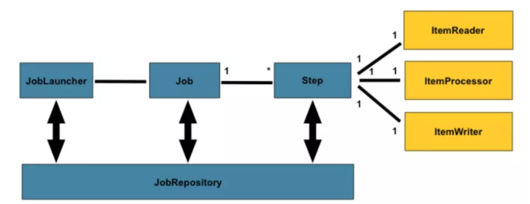
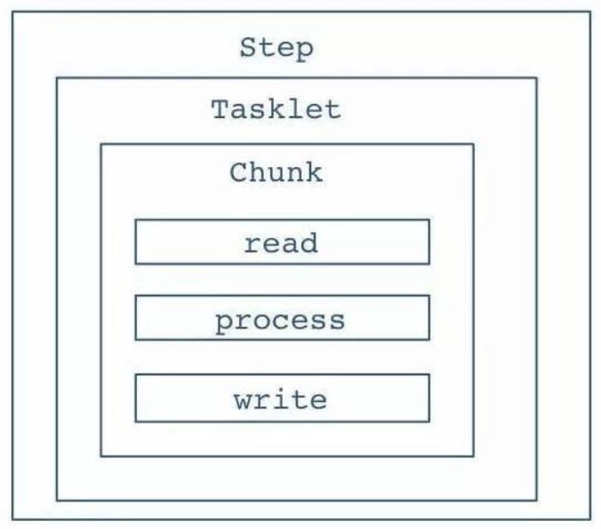

参考文章：

https://segmentfault.com/a/1190000016278038?utm_source=tag-newest

https://www.jianshu.com/p/6f038c1f6037

# Spring Batch

Spring Batch是一个开源的、全面的、轻量级的批处理框架，通过Spring Batch可以实现强大的批处理应用程序的开发。Spring Batch 还提供记录/跟踪、事务管理、作业处理统计、作业重启以及资源管理等功能。Spring Batch结合定时任务可以发挥更大的作用。
Spring Batch提供了ItemReader、ItemProcessor 和ItemWriter来完成数据的读取、处理以及写出操作，并且可以将批处理的执行状态持久化到数据库中。接下来通过一个简单的数据复制展示Spring Boot中如何使用Spring Batch。


# Spring Batch 结构

下面先介绍下Spring Batch框架里用到的名词，然后再介绍下他们之间的关系。

**Job**： 是Spring Batch的核心概念，它包含了批处理的所有操作。

**Step**：每个Job由一个或多个Step组成，每个Step中涉及到ItemReader、ItemProcessor、ItemWriter，这三个接口顾名思义，一个负责数据源读取、一个负责业务逻辑处理、一个负责处理后的数据输出。

**JobRepository**：定义Job时，需要指定一个JobRepository，用来存储Job在运行过程中的状态信息，为什么要存储状态信息呢？因为如果Job失败了，Spring支持从失败的地方重新运行，而不是从头开始。

**JobLauncher**：很好理解launcher是用来执行Job的，如果不设置，系统也会默认给Job配置一个默认Launcher。




借助于Spring Batch已经实现了大部分的基础功能，作为开发者要做的除了配置每个Step之间的依赖关系和Job的一些参数就是开发每一步的Step，Step是一个独立封装域对象，包含了所有定义和控制实际处理信息批量任务的序列。每一个Step都是开发者自己编写的，一个Step的简单或复杂完全取决于开发者，可以把一个大的Step拆成很多个，也可以在一个Step中实现，完全看开发者的意愿。

所有的批处理都可以描述为最简单的过程：读取大量数据，执行自定义的计算或者转换，写出处理结果，Spring Batch提供了三个主要接口来执行大量数据的读取、处理与写出：ItemReader、ItemProcessor、ItemWriter。

**ItemReader**

ItemReader就是一种从各个数据源读取数据，然后提供给后续步骤使用的接口，目前Spring Batch已经给我们实现了3种常用格式的处理：

- Flat平面纯文本处理，FlatFileItemReader类实现了从纯文本文件中读取一行数据，目前支持三种格式处理：定长字符串处理、分隔符字符串处理、正则表达式字符串处理，这三种处理基本能够满足我们常见需求了，而且常见的批量数据也都是格式化的纯文本；
- XML，XMLItemReader类提供了解析、验证、映射数据的功能，能够对XML进行处理，同时可以根据XSD schema验证格式信息是否正确；
- 数据库，SQLItemReader类实现了通过JDBC查询出数据集，然后进行数据处理；

如果上面提供的三种都不能满足要求，还可以自己去实现IteamReader接口，来完成从字符串到实体对象的转换。

**ItemWriter**

ItemWriter功能上类似ItemReader的反向操作，资源仍需要定位、打开和关闭，区别ItemWriter执行的是写入操作，而不是读取；

框架同样也实现了类似Reader的常用Writer类，FlatFileItemWriter、XMLItemWriter、SQLItemWriter，具体使用方法可以参考JavaDoc这里就不一一详解了。如果这几个常用Writer类满足不了你的需求那么你也可以继承ItemWriter自己去实现Writer类。

自定义Writer类的话需要注意下，这里需要实现的write方法，入参是一个范型list，而ItemReader的read方法是处理一条字符串，返回一个范型对象。

**ItemProcessor**

ItemProcessor顾名思义就是数据的处理类，这个类系统没有实现类，因为是否需要对数据进行处理，对数据如何处理都是开发者自己来决定的，所以这里框架只是提供了接口，让大家去实现ItemProcessor接口中的process方法。

```java
public interface ItemProcessor<I, O> {
    O process(I var1) throws Exception;
}
```

从接口我们可以看到ItemProcessor是一个双范型接口，需要设置输入和输出类型，第一个类型为我们ItemReader的输出类型，第二个类型为ItemWriter的输入类型也就是process方法按照开发者的意愿处理后输出的类型。

**流程**

首先，Spring Batch运行的基本单位是一个Job，一个Job就做一件批处理的事情。一个Job包含很多Step，step就是每个job要执行的单个步骤。如下图所示，Step里面，会有Tasklet，Tasklet是一个任务单元，它是属于可以重复利用的东西。然后是Chunk，chunk就是数据块，你需要定义多大的数据量是一个chunk。Chunk里面就是不断循环的一个流程，读数据，处理数据，然后写数据。Spring Batch会不断的循环这个流程，直到批处理数据完成。




# 构建Spring Batch

首先，我们需要一个全局的Configuration来配置所有的Job和一些全局配置。

```java
@Configuration
@EnableBatchProcessing(modular = true)
public class SpringBatchConfiguration {
  
}
```

`@EnableBatchProcessing`是打开Batch。如果要实现多Job的情况，需要把`@EnableBatchProcessing`注解的modular设置为true，让每个Job使用自己的ApplicationConext。

## Job

```java
@Bean
Job job() {
    // 通过jobBuilderFactory构建一个Job，get方法的参数就是Job的name
    return jobBuilderFactory.get("job")
        .start(step())
        .build();
}
```

jobBuilderFactory是注入进来的，get里面的就是job的名字。这个job只有一个step。

## Step

```java
@Bean
Step step() {
    // 通过stepBuilderFactory构建一个Step，get方法的参数就是该Step的name
    return stepBuilderFactory.get("step")
        // 参数2表示每读取到两条数据就执行一次write操作
        .<User, User>chunk(2)
        .reader(itemReader())
        .writer(jdbcBatchItemWriter())
        .build();
}
```

stepBuilderFactory是注入进来的，然后get里面是Step的名字。Step中可以构建很多东西，比如reader，processer，writer，listener等等。

## Chunk

Spring batch在配置Step时采用的是基于Chunk的机制，即每次读取一条数据，再处理一条数据，累积到一定数量后再一次性交给writer进行写入操作。这样可以最大化的优化写入效率，整个事务也是基于Chunk来进行。比如我们定义chunk size是50，那就意味着，spring batch处理了50条数据后，再统一向数据库写入。

```
.<User, User>chunk(CHUNK_SIZE)
```

这里的类型必须写明。

## Reader

Reader顾名思义就是从数据源读取数据。

Spring Batch给我们提供了很多好用实用的reader，基本能满足我们所有需求。比如FlatFileItemReader，JdbcCursorItemReader，JpaPagingItemReader等。也可以自己实现Reader。

本例子里面，数据源是文本文件，所以我们就使用FlatFileItemReader。FlatFileItemReader是从文件里面一行一行的读取数据。

## Line Mapper

```java
reader.setLineMapper(new DefaultLineMapper<User>() {{
    setLineTokenizer(new DelimitedLineTokenizer() {{
        // 设置每一行的数据信息
        setNames("name", "age", "address");
        // 配置列与列之间的间隔符
        setDelimiter(" ");
    }});
    // 设置要映射的实体类属性
    setFieldSetMapper(new BeanWrapperFieldSetMapper<User>() {{
        setTargetType(User.class);
    }});
}});
```

## Processor

需要实现如下接口 ：

```java
public interface ItemProcessor<I, O> {
    O process(I item) throws Exception;
}
```

## Writer

Writer顾名思义就是把数据写入到目标数据源里面。

Spring Batch同样给我们提供很多好用实用的writer。比如JpaItemWriter，FlatFileItemWriter，HibernateItemWriter，JdbcBatchItemWriter等。同样也可以自定义。


# 测试

启动项目，访问`localhost:8080/test`，查看数据库，发现data.txt中的数据已经加入。


# 注意事项

```java
// 第二个参数jobParameters 必须加上时间戳，否则Spring Batch框架job任务只会执行一次
jobLauncher.run(job, new JobParametersBuilder().addDate("date", new Date()).toJobParameters());
```

需要注意这里controller中的run方法，第二个参数必须设置时间戳，否则批量任务只会执行一次。


代码解释：

创建CsvBatchJobConfig进行Spring Batch配置，同时注入JobBuilderFactory、StepBuilderFactory 以及DataSource备用，其中JobBuilderFactory 将用来构建Job，StepBuilderFactory用来构建Step，DataSource则用来支持持久化操作，这里持久化方案是Spring-Jdbc。
第9-25行配置一个ItemReader，Spring Batch 提供了一些常用的ItemReader，例如JdbcPagingltemReader用来读取数据库中的数据，StaxEventltemReader用来读取XML数据，本案例中的FlatFileltemReader则是一个加载普通文件的ItemReader。在FlatFileltemReader的配置过程中，由于data.csv文件第一行是标题，因此通过setLinesToSkip方法设置跳过一行，然后通过setResource方法配置data.csv文件的位置，笔者的data.csv文件放在claspath目录下，然后通过setLineMapper方法设置每一行的数据信息，setNames方法配置了data.csv文件一共有4列，分别是id、username、address以及gender，setDelimiter则是配置列与列之间的间隔符（将通过间隔符对每一行的数据进行切分），最后设置要映射的实体类属性即可。
·第26-35行配置ItemWriter，即数据的写出逻辑，Spring Batch也提供了多个ItemWriter的实现，常见的如FlatFileltemWriter，表示将数据写出为一个普通文件，StaxEventltemWriter表示将数据写出为XML。另外，还有针对不同数据库提供的写出操作支持类，如MongoltemWriter、Jpaltem Writer、Neo4jltemWriter以及HibernateltemWriter等，本案例使用的JdbcBatchltemWriter则是通过JDBC将数据写出到一个关系型数据库中。JdbcBatchltemWriter主要配置数据以及数据插入SQL，注意占位符的写法是“：属性名”。最后通过
BeanPropertyItemSqlParameterSourceProvider 实例将实体类的属性和SQL中的占位符一一映
·第36-43行配置一个Step，Step 通过stepBuilderFactory 进行配置，首先通过get获取一个StepBuilder，get方法的参数就是该Step的name，然后调用chunk方法的参数2表示每读取到两条数据就执行一次write操作，最后分别配置reader和writer。
·第44-49行配置一个Job，通过jobBuilderFactory构建一个Job，get方法的参数为Job的name，然后配置该Job的Step即可。