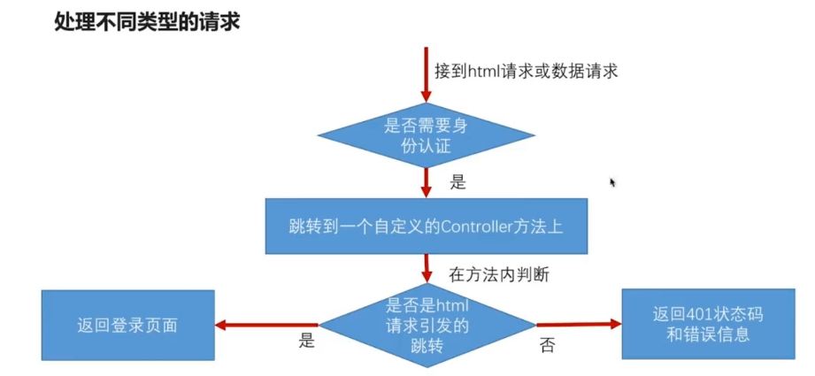
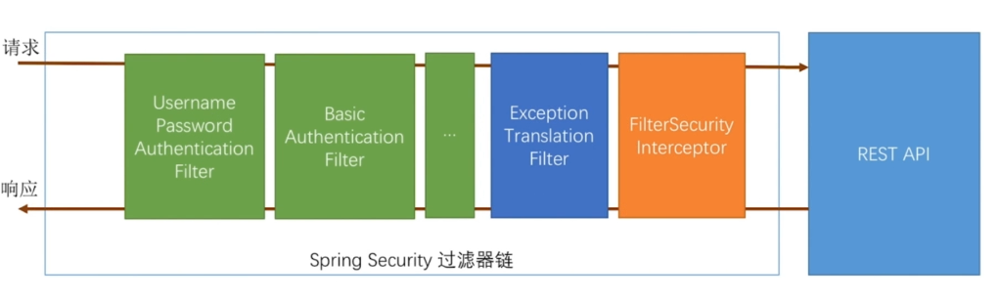
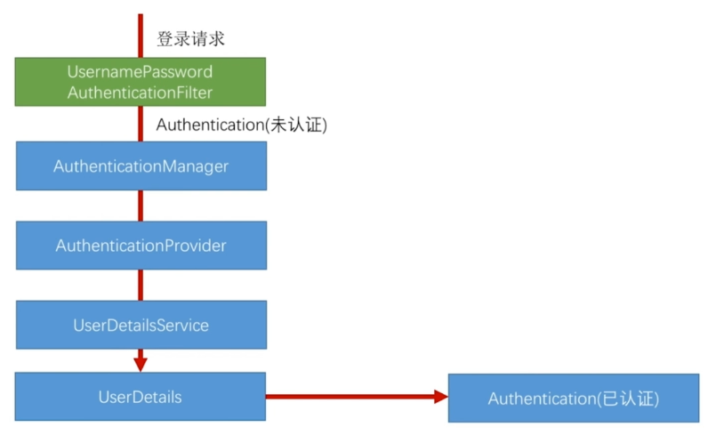
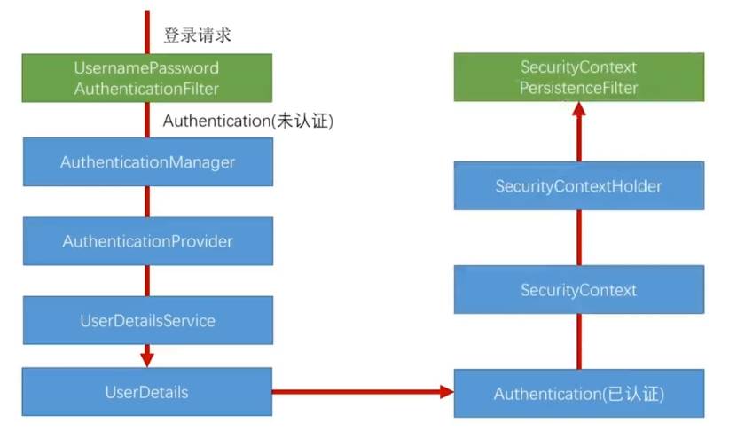
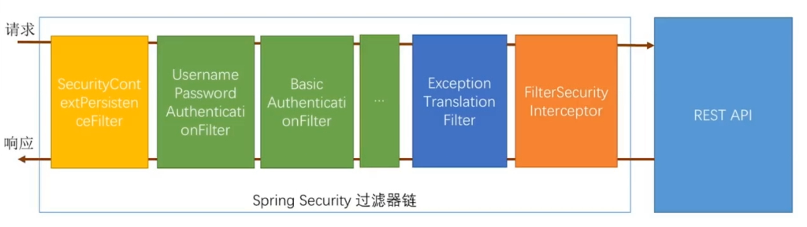
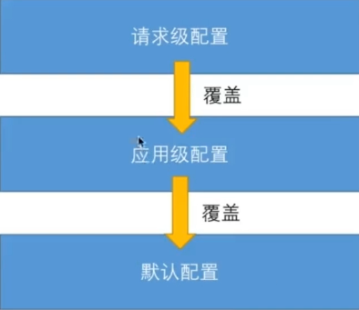
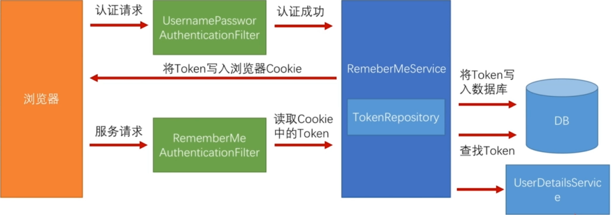
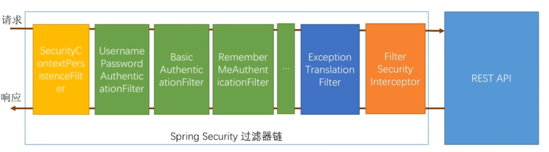
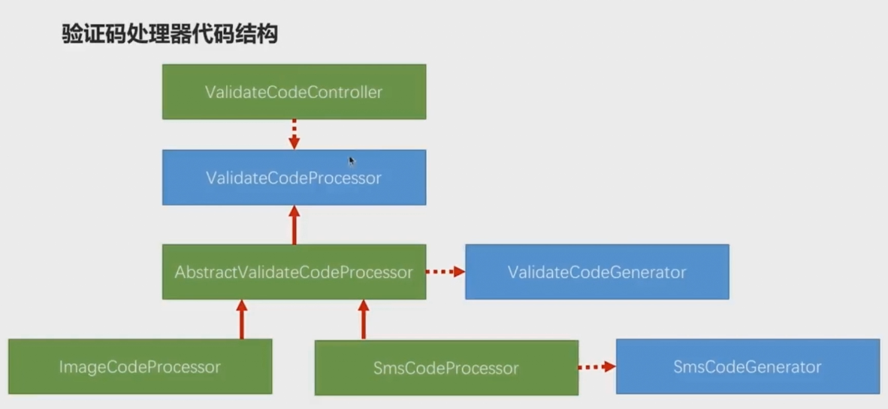
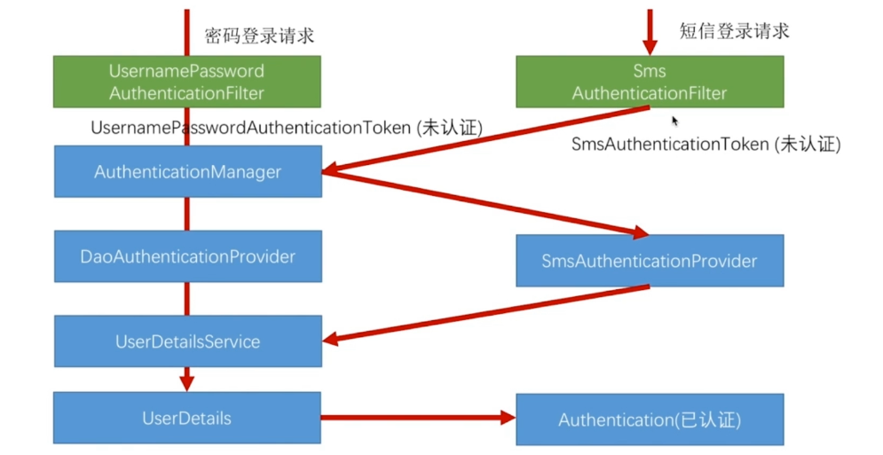

# Spring Security

## 自定义用户认证逻辑

### 处理用户信息获取逻辑

```java
public interface UserDetailsService {
	UserDetails loadUserByUsername(String username) throws UsernameNotFoundException;
}
```

方法`loadUserByUsername`用于读取用户信息，然后封装在`UserDetails`接口的实现里，然后Spring Security会拿到用户信息进行处理和校验，处理和校验通过后，就会把信息放入session中；否则就会抛出`UsernameNotFoundException`异常。

现在自己实现`UserDetailsService`

```java
@Service
public class MyUserDetailsService implements UserDetailsService {

    private Logger logger = LoggerFactory.getLogger(getClass());

    @Autowired
    private BCryptPasswordEncoder passwordEncoder;


    @Override
    public UserDetails loadUserByUsername(String username) throws UsernameNotFoundException {
        logger.info("表单登录用户名:" + username);
        return new User(username, passwordEncoder.encode("123456"), AuthorityUtils.commaSeparatedStringToAuthorityList("admin,user"));
    }
}
```

为什么返回`User`？这个`User`是Spring Security中的，由于它实现了`UserDetails`接口。

这里为什么需要加密？如下，

>启动报错：There is no PasswordEncoder mapped for the id "null"
>
>原因：Spring Security在5.0后就要加个PasswordEncoder

因此需要在配置类中加入实现了`PasswordEncoder`接口的类，如下。

```java
@Bean
public PasswordEncoder passwordEncoder(){
    return new BCryptPasswordEncoder();
}
```


### 处理用户校验逻辑

在`UserDetails`接口中，有几个方法是用来处理用户自己的校验逻辑的，如下。

```java
// 用户是否过期，true表示没有过期
boolean isAccountNonExpired();
// 用户是否冻结，可以恢复，比如封号一段时间
boolean isAccountNonLocked();
// 密码是否过期
boolean isCredentialsNonExpired();
// 可用于标记该用户是否被删除，并不是真正删除，但是不可恢复，比如被永久封号
boolean isEnabled();
```

我们可以实现上面四个方法来完成自己的校验逻辑。

```java
// ...
// 根据查找的用户判断该用户是否被冻结或删除
// ...
return new User(username, passwordEncoder.encode("123456"), true, true, true, true, AuthorityUtils.commaSeparatedStringToAuthorityList("admin,user"));

```

这里四个都为`true`。


### 处理密码加密解密

如上，使用了`BCryptPasswordEncoder`类来加密和解密，加密是自己操作，解密是Spring Security来操作。

>经过`BCryptPasswordEncoder`加密的同一个字符串，每次加密的结果都不一样。


## 个性化用户认证流程

### 自定义登录页面

Spring Security默认使用的是/login的POST请求处理表单提交。

```java
public UsernamePasswordAuthenticationFilter() {
    super(new AntPathRequestMatcher("/login", "POST"));
}
```

我们可以通过`loginProcessingUrl("/myLogin")`来配置成自己的请求路径。

为了处理不同的请求，请看下图。



我们需要修改登录成功后`loginPage("/authentication/require")`到Controller响应的请求，由Controller判断返回页面还是错误信息。

`HttpSessionRequestCache`存放了请求的缓存，`SavedRequest`是请求缓存的类型。

```java
@RequestMapping("/authentication/require")
@ResponseStatus(code = HttpStatus.UNAUTHORIZED)
public SimpleResponse requireAuthentication(HttpServletRequest request, HttpServletResponse response) throws IOException {

    SavedRequest savedRequest = requestCache.getRequest(request, response);

    if (savedRequest != null) {
        String targetUrl = savedRequest.getRedirectUrl();
        logger.info("引发跳转的请求是:" + targetUrl);
        if (StringUtils.endsWithIgnoreCase(targetUrl, ".html")) {
            redirectStrategy.sendRedirect(request, response, securityProperties.getBrowser().getLoginPage());
        }
    }

    return new SimpleResponse("访问的服务需要身份认证，请引导用户到登录页");
}
```

如果在application.properties中配置了自定义登录页`security.browser.loginPage = /index`，那么就会重定向到自己的登录页，否则就会使用默认登录页。


### 自定义登录成功处理

支持自定义返回JSON还是跳转成功页面。

有两个方法可以实现自定义登录处理：

- 实现`AuthenticationSuccessHandler`接口
- 继承`SavedRequestAwareAuthenticationSuccessHandler`类

这里选择第二种，原因是第二种方法可以保存之前访问被拦截的页面，一旦登录成功，会直接访问之前输入的页面，而不是指定到我们默认的首页。

```java
@Component
public class MyAuthenticationSuccessHandler extends SavedRequestAwareAuthenticationSuccessHandler {

    private Logger logger = LoggerFactory.getLogger(getClass());

    @Autowired
    private ObjectMapper objectMapper;

    @Autowired
    private SecurityProperties securityProperties;

    @Override
    public void onAuthenticationSuccess(HttpServletRequest request, HttpServletResponse response,
                                        Authentication authentication) throws IOException, ServletException {

        logger.info("登录成功");

        // 判断是否是JSON形式返回
        if (LoginResponseType.JSON.equals(securityProperties.getBrowser().getLoginType())) {
            response.setContentType("application/json;charset=UTF-8");
            response.getWriter().write(objectMapper.writeValueAsString(authentication));
        } else {
            // 否则跳转页面
            super.onAuthenticationSuccess(request, response, authentication);
        }

    }

}
```

如果在application.properties中配置了返回格式`security.browser.loginType= REDIRECT`，那么就会跳转成功页面，否则就会返回JSON。


### 自定义登录失败处理

支持自定义返回JSON还是跳转失败页面。

```java
@Component
public class MyAuthenctiationFailureHandler extends SimpleUrlAuthenticationFailureHandler {

    private Logger logger = LoggerFactory.getLogger(getClass());

    @Autowired
    private ObjectMapper objectMapper;

    @Autowired
    private SecurityProperties securityProperties;

    @Override
    public void onAuthenticationFailure(HttpServletRequest request, HttpServletResponse response,
                                        AuthenticationException exception) throws IOException, ServletException {

        logger.info("登录失败");

        // 判断是否是JSON形式返回
        if (LoginResponseType.JSON.equals(securityProperties.getBrowser().getLoginType())) {
            response.setStatus(HttpStatus.INTERNAL_SERVER_ERROR.value());
            response.setContentType("application/json;charset=UTF-8");
            response.getWriter().write(objectMapper.writeValueAsString(new SimpleResponse(exception.getMessage())));
        } else {
            // 否则跳转页面
            super.onAuthenticationFailure(request, response, exception);
        }

    }

}
```

如果在application.properties中配置了返回格式`security.browser.loginType= REDIRECT`，那么就会跳转失败页面，否则就会返回JSON。


## 认证流程

### 认证处理流程说明

Spring Security核心就是一系列的过滤器链，当一个请求来的时候，首先要通过过滤器链的校验，校验通过之后才会访问用户各种信息。 





当用户发送登录请求的时候，首先进入到`UsernamePasswordAuthenticationFilter`中进行校验。 

在该类中，有一个`attemptAuthentication`方法在这个方法中，会获取用户的username以及password参数的信息，然后使用构造器`new UsernamePasswordAuthenticationToken(username, password)`封装为一个`UsernamePasswordAuthenticationToken`对象，构造方法如下。

```java
public UsernamePasswordAuthenticationToken(Object principal, Object credentials) {
    // 调用父类构造器，传一个null值进去
    super(null);
    this.principal = principal;
    this.credentials = credentials;
    setAuthenticated(false);
}
```

在这个构造器内部会将对应的信息赋值给各自的本地变量，并且会调用父类`AbstractAuthenticationToken`构造器，传一个null值进去，为什么是null呢？因为刚开始并没有认证，因此用户没有任何权限，并且设置没有认证的信息`setAuthenticated(false)`。

实例化`UsernamePasswordAuthenticationToken`之后调用了`setDetails(request, authRequest`)将请求的信息设到`UsernamePasswordAuthenticationToken`中去，包括ip、session等内容。

然后去调用`AuthenticationManager`，它本身不包含验证的逻辑，它的作用是用来管理`AuthenticationProvider`，如下代码。

```java
return this.getAuthenticationManager().authenticate(authRequest);
```

authenticate这个方法是在`ProviderManager`类上的，这个类实现了`AuthenticationManager`接口，在authenticate方法中有一个for循环，去拿到所有的`AuthenticationProvider`，真正校验的逻辑是写在`AuthenticationProvider`中的，为什么是一个集合去进行循环？是因为不同的登陆方式认证逻辑是不一样的，可能是微信等社交平台登陆，也可能是用户名密码登陆。`AuthenticationManager`其实是将`AuthenticationProvider`收集起来，然后登陆的时候挨个去`AuthenticationProvider`中问你这种验证逻辑支不支持此次登陆的方式，根据传进来的`Authentication`类型会挑出一个适合的provider来进行校验处理，然后调用provider的authenticate验证方法，authenticate是`DaoAuthenticationProvider`类中的一个方法，`DaoAuthenticationProvider`继承了`AbstractUserDetailsAuthenticationProvider`。实际上authenticate的校验逻辑写在了`AbstractUserDetailsAuthenticationProvider`抽象类中，首先实例化`UserDetails`对象，调用了retrieveUser方法获取到了一个`User`对象，retrieveUser是一个抽象方法。

```java
UserDetails loadedUser = this.getUserDetailsService().loadUserByUsername(username);
```

如上代码，`DaoAuthenticationProvider`实现了retrieveUser方法，获取`UserDetailsService`类型的对象，这个对象在是我们之前自定义的实现了`UserDetailsService`接口的`MyUserDetailsService`类，返回结果就是我们自己在数据库中根据username查询出来的用户信息。

在`AbstractUserDetailsAuthenticationProvider`中如果没拿到用户信息就会抛出异常，如果拿到了就会去调用`preAuthenticationChecks.check(user)`进行预检查。在预检查中进行了三个检查，因为`UserDetail`类中有四个布尔类型，去检查其中的三个，用户是否锁定、用户是否过期，用户是否可用。

预检查之后紧接着去调用了additionalAuthenticationChecks方法去进行附加检查，这个方法也是一个抽象方法，在`DaoAuthenticationProvider`中去具体实现，在里面进行了加密解密去校验当前的密码是否匹配。

如果通过了预检查和附加检查，还会进行后检查，检查四个布尔中的最后一个。所有的检查都通过，则认为用户认证是成功的。用户认证成功之后，会将这些认证信息和User传递进去，调用createSuccessAuthentication方法。在这个方法中同样会实例化一个User，但是这个方法不会调用之前传两个参数的函数，而是会调用三个参数的构造函数。这个时候，在调super的构造函数中不会再传null，而是将authorities权限设置进去，之后将用户密码设进去，最后`setAuthenticated(true)`，代表验证已经通过。

最后创建一个authentication会沿着验证的这条线返回回去。如果验证成功，则在这条路中调用我们系统的业务逻辑。如果在任何一处发生问题，就会抛出异常，调用我们自己定义的认证失败的处理器。


### 认证结果如何在多个请求之间共享



在验证成功之后，会调用`AbstractAuthenticationProcessingFilter`中的successfulAuthentication方法，在这个方法最后会调用我们自定义的successHandler登陆成功处理器，在调用这个方法之前会调用`SecurityContextHolder.getContext()`的setAuthentication方法，会将我们验证成功的那个`Authentication`放到`SecurityContext`中，然后再放到`SecurityContextHolder`中。`SecurityContextImpl`中只是重写了hashcode方法和equals方法去保证`Authentication`的唯一。

`SecurityContextHolder`是`ThreadLocal`的一个封装，`ThreadLocal`是线程绑定的一个map，在同一个线程里在这个方法里往`ThreadLocal`里设置的变量是可以在另一个线程中读取到的。它是一个线程级的全局变量，在一个线程中操作`ThreadLocal`中的数据会影响另一个线程。也就是说创建成功之后，塞进去，此次登陆所有的请求都会通过`SecurityContextPersisenceFilter`去`SecurityContextHolder`拿那个`Authentication`。`SecurityContextHolder`在整个过滤器的最前面。



当请求进来的时候，会先经过`SecurityContextPersisenceFilter`，`SecurityContextPersisenceFilter`会去session中查`SecurityContext`的验证信息，如果有，就把`SecurityContext`的验证信息放到线程里直接返回回去，如果没有则通过，去通过其他的过滤器，当请求处理完回来之后，`SecurityContextHolder`会去检查当前线程中有没有`SecurityContext`的验证信息，如果有，则将`SecurityContext`放到session中。通过这样将不同的请求就可以从同一个session里拿到验证信息。

> 简单来说就是进来的时候检查session，有认证信息放到线程里。出去的时候检查线程，有认证信息放到session里。
> 因为整个请求和响应的过程都是在一个线程里去完成的，所以在线程的其他位置随时可以用SecurityContextHolder来拿到认证信息。


### 获取认证用户信息

```java
@GetMapping("/me")
public Object getCurrentUser(@AuthenticationPrincipal UserDetails userDetails){
    return userDetails;
}
```


## 生成图片验证码

### 根据随机数生成图片

定义一个实体类，封装验证码的信息，其中包含图片信息，验证码，以及过期时间。

[ImageCode ]()

在重写构造方法的时候，入参是一个int类型的一个过期时间，单位是秒。然后在构造方法里面`this.expireTime = LocalDateTime.now().plusSeconds(expireTime)`，表示将过期时间设为一个未来的一个时间。这个类中还有一个判断验证码是否过期的一个方法isExpried。


### 将随机数存入Session

```
private SessionStrategy sessionStrategy = new HttpSessionSessionStrategy();

sessionStrategy.setAttribute(new ServletWebRequest(request), SESSION_KEY, imageCode);
```

[ValidateCodeController]()


### 将生成的图片写到接口的响应中

Spring Security并没有提供图像验证码的过滤器，但是我们可以在过滤器链中加入我们自己写的图形过滤器。就是在`UsernamePasswordAuthenticationFilter`过滤器之前加一个自己写的过滤器。在自己写的过滤器里面去执行校验的逻辑，如果验证通过则将请求通过，如果验证失败就抛出异常。

```java
ValidateCodeFilter validateCodeFilter = new ValidateCodeFilter();
validateCodeFilter.setAuthenticationFailureHandler(myAuthenctiationFailureHandler);

http.addFilterBefore(validateCodeFilter, UsernamePasswordAuthenticationFilter.class)
    ...
```

[ValidateCodeFilter]()


### 重构

图形验证码基本参数配置如下图所示。默认配置是在`com.feichaoyu.security.core`包下的配置，应用配置是在自己的应用中配置，请求配置是在调用接口时传递的。



#### 验证码参数可配置

默认配置

[ImageCodeProperties]()

配置文件中配置如下：

```yml
core.security.code.image.length = 6
core.security.code.image.width = 100
```

请求路径配置如下：

```

```

那么最终效果就是图形验证码的长度是6位，宽度是200px，因为请求级>配置文件>默认配置。


#### 验证码拦截接口可配置

让`ValidateCodeFilter`实现`InitializingBean`接口，目的是为了在在其他参数组装完毕后，初始化url的值。实现了`afterPropertiesSet()`方法。

[ValidateCodeFilter]()

之后只需要在配置文件中写自己要拦截的路径即可，如下。

```yml
security.code.image.url=/test,/test/*
```


#### 验证码生成逻辑可配置

定义一个验证码生成逻辑的接口

```java
public interface ValidateCodeGenerator {
    ValidateCode generate(ServletWebRequest request);
}
```

然后让图片验证码生成器实现该接口，并把自己的逻辑写入即可。默认生成逻辑见[ImageCodeGenerator]()

如果需要实现自己的生成逻辑，可以配置自己的Bean，如下所示。

```java
@Component("imageValidateCodeGenerator")
public class DemoImageCodeGenerator implements ValidateCodeGenerator {

    @Override
    public ImageCode generate(ServletWebRequest request) {
        System.out.println("更高级的图形验证码生成代码");
        return null;
    }

}
```

原因是我做了如下配置：

```java
@Configuration
public class ValidateCodeBeanConfig {

    @Autowired
    private SecurityProperties securityProperties;

    @Bean
    @ConditionalOnMissingBean(name = "imageValidateCodeGenerator")
    public ValidateCodeGenerator imageValidateCodeGenerator() {
        ImageCodeGenerator codeGenerator = new ImageCodeGenerator();
        codeGenerator.setSecurityProperties(securityProperties);
        return codeGenerator;
    }

}
```

注意到`@ConditionalOnMissingBean(name = "imageValidateCodeGenerator")`，如果用户没有自己配置生成码Bean，那么使用默认配置，否则使用用户自定义配置。


## 记住我



登录的时候，请求发送给过滤器`UsernamePasswordAuthenticationFilter`，当该过滤器认证成功后，会调用`RememberMeService`，会生成一个token，将token写入到浏览器cookie，同时`RememberMeService`里边还有个`TokenRepository`，将token和用户信息写入到数据库中。这样当用户再次访问系统，访问某一个接口时，会经过一个`RememberMeAuthenticationFilter`的过滤器，他会读取cookie中的token，交给`RememberService`，`RememberService`会用`TokenRepository`根据token从数据库中查是否有记录，如果有记录会把用户名取出来，再调用`UserDetailService`根据用户名获取用户信息，然后放在`SecurityContext`里。



`RememberMeAuthenticationFilter`在Spring Security中认证过滤器链的位置如上，当其他认证过滤器都没法认证成功的时候，就会调用`RememberMeAuthenticationFilter`尝试认证。

只需如下配置：

```java
@Bean
public PersistentTokenRepository persistentTokenRepository() {
    JdbcTokenRepositoryImpl tokenRepository = new JdbcTokenRepositoryImpl();
    tokenRepository.setDataSource(dataSource);
    // 只需要一次
    // tokenRepository.setCreateTableOnStartup(true);
    return tokenRepository;
}
```

```java
.and()
    .rememberMe()
    .tokenRepository(persistentTokenRepository())
    .tokenValiditySeconds(securityProperties.getBrowser().getRememberMeSeconds())
    .userDetailsService(userDetailsService);
```

最后数据库中会创建一张表persistent_logins，记住我登录后会存储类似如下信息：

| username | series                   | token                    | last_used           |
| -------- | ------------------------ | ------------------------ | ------------------- |
| John     | 1qid8b8xlXNgwfNWMP/jng== | 1MQYF9j/TOLwmSyybl6LfA== | 2019-08-07 21:59:30 |

下次登录就会直接用这个信息登录，不需要再次输入登录信息。


## 短信验证码登录

### 短信验证码接口




### 校验短信验证码并登录




