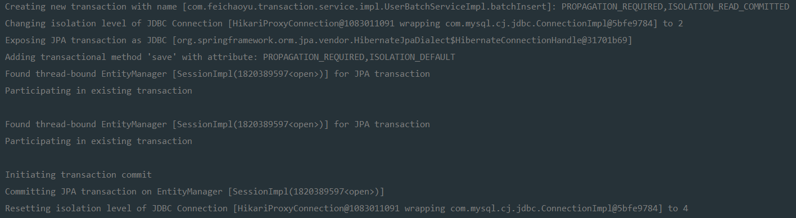
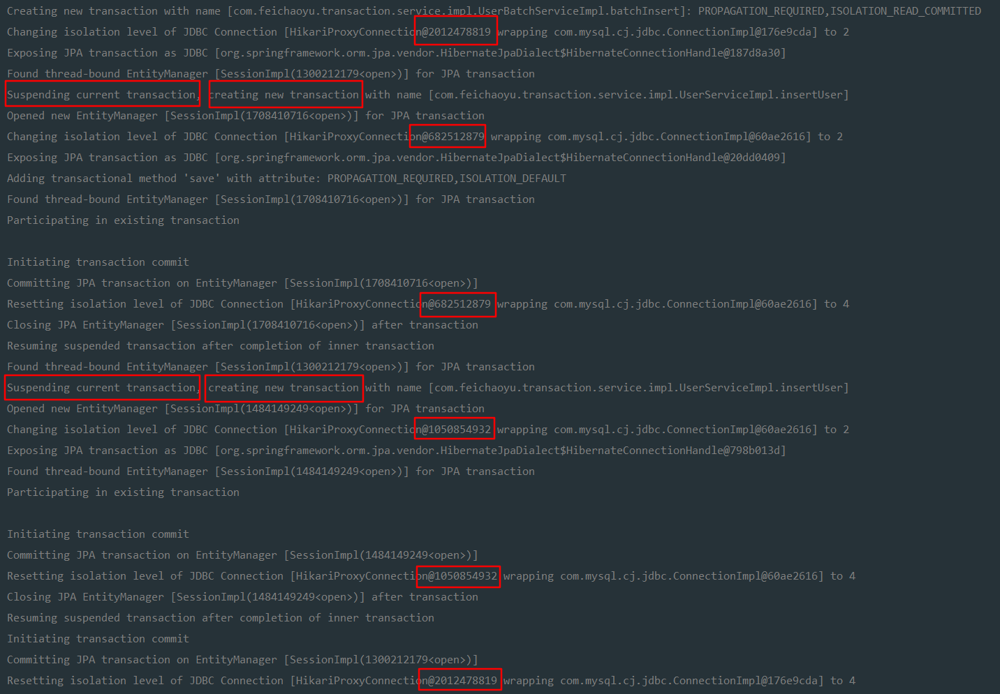

# Spring事务

## 事务简介

事务管理是企业级应用程序开发中必不可少的技术，用来确保数据的完整性和一致性。

事务有四大特性：

- Atomic（原子性）：事务中包含的操作被看作一个整体的业务单元，这个业务单元中的操作要么全部成功，要么全部失败，不会出现部分失败、部分成功的场景。
- Consistency（一致性）：事务在完成时，必须使所有的数据都保持一致状态，在数据库中所有的修改都基于事务，保证了数据的完整性。
- Isolation（隔离性）：可能多个应用程序线程同时访问同一数据，这样数据库同样的数据就会在各个不同的事务中被访问，这样会产生丢失更新。为了压制丢失更新的产生，数据库定义了隔离级别的概念，通过它的选择，可以在不同程度上压制丢失更新的发生。因为互联网的应用常常面对高并发的场景，所以隔离性是需要掌握的重点内容。
- Durability（持久性）：事务结束后，所有的数据会固化到一个地方，如保存到磁盘当中，即使断电重启后也可以提供给应用程序访问。

作为企业级应用程序框架，Spring在不同的事务管理API上定义了一个抽象层，而应用程序开发人员不必了解底层的事务管理API，就可以使用Spring的事务管理机制。

Spring既支持编程式事务管理（也称编码式事务），又支持声明式事务管理。编程式事务管理是指将事务管理代码嵌入业务方法中来控制事务的提交和回滚。在编程式事务中，必须在每个业务操作中包含额外的事务管理代码。声明式事务管理是指将事务管理代码从业务方法中分离出来，以声明的方式来实现事务管理。在大多数情况下，声明式事务管理比编程式事务管理更好用。Spring通过Spring AOP支持声明式事务管理。


## 事务管理器

事务的打开、回滚和提交是由事务管理器来完成的。在Spring中，事务管理器的顶层接口为`Platform TransactionManager`，Spring还为此定义了一些列的接口和类，不同的数据访问技术使用不同的接口实现。

| 数据访问技术 | 实现                         |
| ------------ | ---------------------------- |
| JDBC         | DataSourceTransactionManager |
| JPA          | JpaTransactionManager        |
| Hibernate    | HibernateTransactionManager  |
| 分布式事务   | JtaTransactionManager        |

PlatformTransactionManager源码如下：

```java
public interface PlatformTransactionManager {

    // 获取事务，设置数据属性
    TransactionStatus getTransaction(@Nullable TransactionDefinition definition)
        throws TransactionException;
 
    // 提交事务
    void commit(TransactionStatus status) throws TransactionException;

    // 回滚事务
    void rollback(TransactionStatus status) throws TransactionException;

}
```

Spring在事务管理时，就是将这些方法按照约定织入对应的流程中的，其中getTransaction方法的参数是一个事务定义器（TransactionDefinition），它是依赖于我们配置的`@Transactional`的配置项生成的，于是通过它就能够设置事务的属性了，而提交和回滚事务也就可以通过commit和rollback方法来执行。

在Spring Boot中，当你依赖于mybatis-spring-boot-starter之后，它会自动创建一个DataSourceTransactionManager 对象，作为事务管理器，如果依赖于spring-boot-starter-data-jpa，则它会自动创建JpaTransactionManager对象作为事务管理器，所以我们一般不需要自己创建事务管理器而直接使用它们即可。

## @Transactional注解

```java
public @interface Transactional {

    // 通过bean name指定事务管理器
	@AliasFor("transactionManager")
	String value() default "";

    // 同value属性
	@AliasFor("value")
	String transactionManager() default "";

    // 指定传播行为
	Propagation propagation() default Propagation.REQUIRED;

    // 指定隔离级别
	Isolation isolation() default Isolation.DEFAULT;

    // 指定超时时间，单位秒
	int timeout() default TransactionDefinition.TIMEOUT_DEFAULT;

    // 是否只读事务
	boolean readOnly() default false;

    // 方法在发生指定异常时回滚，默认是所有异常都回滚
	Class<? extends Throwable>[] rollbackFor() default {};

    // 方法在发生指定异常名称时回滚，默认是所有异常都回滚
	String[] rollbackForClassName() default {};

    // 方法在发生指定异常时不回滚，默认是所有异常都回滚
	Class<? extends Throwable>[] noRollbackFor() default {};

    // 方法在发生指定异常名称时不回滚，默认是所有异常都回滚
	String[] noRollbackForClassName() default {};
    
}
```

关于`@Transactional`的位置有以下两点需要注意：

> @Transactional可以放在接口上，也可以放在实现类上。但是Spring官方推荐放在实现类上，因为放在接口上将使得你的类基于接口的代理时它才生效。我们知道在Spring可以使用JDK动态代理，也可以使用CGLIG动态代理。如果使用接口，那么你将不能切换为CGLIB动态代理，而只能允许你使用JDK动态代理，并且使用对应的接口去代理你的类，这样才能驱动这个注解，这将大大地限制你的使用，因此在实现类上使用@Transactional注解才是最佳的方式。

>@Transactional可以放在类上也可以放在方法上，放在类上意味着此类的所有public方法都是开启事务的。方法级别上会覆盖类级别。


## 传播行为

传播行为是方法之间调用事务采取的策略问题。在绝大部分的情况下，我们会认为数据库事务要么全部成功，要么全部失败。但现实中也许会有特殊的情况。例如，执行一个批量程序，它会处理很多的交易，绝大部分交易是可以顺利完成的，但是也有极少数的交易因为特殊原因不能完成而发生异常，这时我们不应该因为极少数的交易不能完成而回滚批量任务调用的其他交易，使得那些本能完成的交易也变为不能完成了。此时，我们真实的需求是，在一个批量任务执行的过程中，调用多个交易时，如果有一些交易发生异常，只是回滚那些出现异常的交易，而不是整个批量任务，这样就能够使得那些没有问题的交易可以顺利完成，而有问题的交易则不做任何事情。

在Spring中，当一个方法调用另外一个方法时，可以让事务采取不同的策略工作，如新建事务或者挂起当前事务等，这便是事务的传播行为。举个例子，批量任务我们称之为当前方法，那么批量事务就称为当前事务，当它调用单个交易时，称单个交易为子方法，当前方法调用子方法的时候，让每一个子方法不在当前事务中执行，而是创建一个新的事务去执行子方法，我们就说当前方法调用子方法的传播行为为新建事务。此外，还可能让子方法在无事务、独立事务中执行，这些完全取决于你的业务需求。

Spring定义了7种传播行为，通过枚举类Propagation定义。

```java
public enum Propagation {

    /**
     * 需要事务，它是默认传播行为，如果当前存在事务，就沿用当前事务，否则新建一个事务运行子方法
     */
	REQUIRED(TransactionDefinition.PROPAGATION_REQUIRED),

    /**
     * 支持事务，如果当前存在事务，就沿用当前事务，如果不存在，则继续采用无事务的方式运行子方法
     */
	SUPPORTS(TransactionDefinition.PROPAGATION_SUPPORTS),

    /**
     * 必须使用事务，如果当前没有事务，则会抛出异常，如果存在当前事务，就沿用当前事务
     */
	MANDATORY(TransactionDefinition.PROPAGATION_MANDATORY),

    /**
     * 无论当前事务是否存在，都会创建新事务运行方法，这样新事务就可以拥有新的锁和隔离级别等特性，与当前事务相互独立
     */
	REQUIRES_NEW(TransactionDefinition.PROPAGATION_REQUIRES_NEW),

    /**
     * 不支持事务，当前存在事务时，将挂起事务，运行方法
     */
	NOT_SUPPORTED(TransactionDefinition.PROPAGATION_NOT_SUPPORTED),

    /**
     * 不支持事务，如果当前方法存在事务，则抛出异常，否则继续使用无事务机制运行
     */
	NEVER(TransactionDefinition.PROPAGATION_NEVER),

    /**
     * 在当前方法调用子方法时，如果子方法发生异常，只回滚子方法执行过的SQL，而不回滚当前方法的事务
     */
	NESTED(TransactionDefinition.PROPAGATION_NESTED);


	private final int value;


	Propagation(int value) {
		this.value = value;
	}

	public int value() {
		return this.value;
	}

}
```


## 隔离级别

### 丢失更新

在此之前，我们先了解两类丢失更新。

- 第一类丢失更新（回滚丢失）：一个事务回滚另一个事务提交而引发的数据不一致的情况。

| 时刻 | 事务1             | 事务2             |
| ---- | ----------------- | ----------------- |
| T1   | 初始库存100       | 初始库存100       |
| T2   | 扣减库存1，库存99 |                   |
| T3   |                   | 扣减库存1，库存99 |
| T4   |                   | 提交事务，库存99  |
| T5   | 回滚事务，库存100 |                   |


- 第二类丢失更新（覆盖丢失）：一个事务的提交，引发另一个事务提交结果的丢失（事务2的提交覆盖了事务1的提交）。

| 时刻 | 事务1             | 事务2             |
| ---- | ----------------- | ----------------- |
| T1   | 初始库存100       | 初始库存100       |
| T2   | 扣减库存1，库存99 |                   |
| T3   |                   | 扣减库存1，库存99 |
| T4   |                   | 提交事务，库存99  |
| T5   | 提交事务，库存99  |                   |

可见，第二类丢失更新和第一类丢失更新的不同发生在**T5时刻是回滚事务还是提交事务**。

由于第一类丢失更新目前数据库都已经解决了，因此我们主要讨论第二类丢失更新。


### 4种隔离级别详解

上面我们讨论了第二类丢失更新。为了压制丢失更新，数据库标准提出了4种隔离级别，在不同的程度上压制丢失更新，这4种隔离级别是**未提交读、读写提交、可重复读和串行化**，它们会在不同的程度上压制丢失更新。

也许你会有一个疑问，都全部消除丢失更新不就好了吗，为什么只是在不同的程度上压制丢失更新呢？其实这个问题是从两个角度去看的，一个是数据的一致性，另一个是性能。数据库现有的技术完全可以避免丢失更新，但是这样做的代价，就是付出锁的代价，在互联网中，系统不单单要考虑数据的一致性，还要考虑系统的性能。试想，在互联网中使用过多的锁，一旦出现商品抢购这样的场景，必然会导致大量的线程被挂起和恢复，因为使用了锁之后，一个时刻只能有一个线程访问数据，这样整个系统就会十分缓慢，当系统被数千甚至数万用户同时访问时，过多的锁就会引发宕机，大部分用户线程被挂起，等待持有锁事务的完成，这样用户体验就会十分糟糕。因为用户等待的时间会十分漫长，一般而言，互联网系统响应超过5秒，就会让用户觉得很不友好，进而引发用户忠诚度下降的问题。所以选择隔离级别的时候，既需要考虑数据的一致性避免脏数据，又要考虑系统性能的问题。因此数据库的规范就提出了4种隔离级别来在不同的程度上压制丢失更新。下面我们通过商品抢购的场景来讲述这4种隔离级别的区别。

- 未提交读

未提交读（read uncommitted）是最低的隔离级别，其含义是允许一个事务读取另外一个事务没有提交的数据。未提交读是一种危险的隔离级别，所以一般在我们实际的开发中应用不广，但是它的优点在于并发能力高，适合那些对数据一致性没有要求而追求高并发的场景，它的最大坏处是出现脏读，如下表所示。

| 时刻 | 事务1     | 事务2    | 备注                                                         |
| ---- | --------- | -------- | ------------------------------------------------------------ |
| T0   |           |          | 商品库存初始化为2                                            |
| T1   | 读取库存2 |          |                                                              |
| T2   | 扣减库存  |          | 库存为1                                                      |
| T3   |           | 扣减库存 | 库存为0，读取事务1未提交的库存数据                           |
| T4   |           | 提交事务 | 库存保存为0                                                  |
| T5   | 回滚事务  |          | 因为第一类丢失更新已经克服，所以不会回滚为2，库存为0，结果错误 |

脏读一般是比较危险的隔离级别，在我们实际应用中采用得不多。为了克服脏读的问题，数据库隔离级别还提供了读写提交（read commited）的级别。

- 读写提交

读写提交（read committed）隔离级别，是指一个事务只能读取另外一个事务已经提交的数据，不能读取未提交的数据。读写提交可以克服脏读，如下表所示。

| 时刻 | 事务1     | 事务2    | 备注                                                         |
| ---- | --------- | -------- | ------------------------------------------------------------ |
| T0   |           |          | 商品库存初始化为2                                            |
| T1   | 读取库存2 |          |                                                              |
| T2   | 扣减库存  |          | 库存为1                                                      |
| T3   |           | 扣减库存 | 库存为1，读取不到事务1未提交的库存数据                       |
| T4   |           | 提交事务 | 库存保存为1                                                  |
| T5   | 回滚事务  |          | 因为第一类丢失更新已经克服，所以不会回滚为2，库存为1，结果正确 |

但是读写提交会产生不可重复读的情况，如下表所示。

| 时刻 | 事务1       | 事务2       | 备注                    |
| ---- | ----------- | ----------- | ----------------------- |
| T0   |             |             | 商品库存初始化为1       |
| T1   | 读取库存为1 |             |                         |
| T2   | 扣减库存    |             | 事务未提交              |
| T3   |             | 读取库存为1 | 认为可扣减              |
| T4   | 提交事务    |             | 库存变为0               |
| T5   |             | 扣减库存    | 失败，库存为0，无法扣减 |

这里的问题在于事务2之前认为可以扣减，而到扣减那一步却发现已经不可以扣减，于是库存对于事务2而言是一个可变化的值，这样的现象我们称为不可重复读，这就是读写提交的一个不足。为了克服这个不足，数据库的隔离级别还提出了可重复读的隔离级别，它能够消除不可重复读的问题。

- 可重复读

可重复读的目标是克服读写提交中出现的不可重复读的现象，因为在读写提交的时候，可能出现一些值的变化，影响当前事务的执行，如上述的库存是个变化的值，这个时候数据库提出了可重复读的隔离级别。这样就能够克服不可重复读的现象，如下表所示。

| 时刻 | 事务1       | 事务2        | 备注                      |
| ---- | ----------- | ------------ | ------------------------- |
| T0   |             |              | 商品库存初始化为1         |
| T1   | 读取库存为1 |              |                           |
| T2   | 扣减库存    |              | 事务未提交                |
| T3   |             | 尝试读取库存 | 不允许读取，等待事务1提交 |
| T4   | 提交事务    |              | 库存变为0                 |
| T5   |             | 读取库存     | 库存为0，无法扣减         |

但在这种情况下，会出现幻读。假设现在商品交易正在进行中，而后台有人也在进行查询分析和打印的业务，如下表所示。

| 时刻 | 事务1           | 事务2              | 备注                                         |
| ---- | --------------- | ------------------ | -------------------------------------------- |
| T1   | 读取库存50      |                    | 商品库存初始化为100，现在还剩50              |
| T2   |                 | 查询交易记录，50笔 |                                              |
| T3   | 扣减库存        |                    |                                              |
| T4   | 插入1笔交易记录 |                    |                                              |
| T5   | 提交事务        |                    | 库存49，交易记录51                           |
| T6   |                 | 打印交易记录，51笔 | 这里与查询的不一致，在事务2看来有1笔是虚幻的 |

这里的笔数不是数据库存储的值，而是一个统计值，商品库存则是数据库存储的值，这一点是要注意的。也就是幻读不是针对一条数据库记录，而是多条记录，例如，这51笔交易笔数就是多条数据库记录统计出来的。而可重复读是针对数据库的单一条记录，例如，商品的库存是以数据库里面的一条记录存储的，它可以产生可重复读，而不能产生幻读。

- 串行化

串行化（Serializable）是数据库最高的隔离级别，它会要求所有的SQL都会按照顺序执行，这样就可以克服上述隔离级别出现的各种问题，所以它能够完全保证数据的一致性。


下表总结了隔离级别对应可能发生的现象。

| 隔离级别 | 脏读 | 不可重复读 | 幻读 |
| :------: | :--: | :--------: | :--: |
| 未提交读 |  √   |     √      |  √   |
| 读写提交 |  ×   |     √      |  √   |
| 可重复读 |  ×   |     ×      |  √   |
|  串行化  |  ×   |     ×      |  ×   |

一般而言，选择隔离级别会以读写提交为主，它能够防止脏读，而不能避免不可重复读和幻读。对于隔离级别，不同的数据库的支持也是不一样的。例如，Oracle只能支持读写提交和串行化，而MySQL则能够支持4种，对于Oracle默认的隔离级别为读写提交，MySQL则是可重复读。


## 使用

配置application.yml为

```
logging:
  level:
    org:
      springframework: debug
```

启动工程，在浏览器输入`http://localhost:8080/batch`

在控制台可以看到如下信息：



1. 创建事务
2. 更改JDBC连接池的隔离级别为读写提交(2)，这里是因为执行的方法要求隔离级别为读写提交，因此spring会改变默认隔离级别，等到方法结束，又会恢复
3. 新增事务方法save
4. 子方法加入已存在的事务中
5. 提交事务
6. 恢复JDBC连接池的隔离级别为可重复读(4)，这里是由使用的数据库决定的，我用了MySQL，所以默认级别为，当然可以通过配置文件更改默认的隔离级别

>Spring Boot2.0以上默认使用的不再是tomcat数据源，而是使用hikari作为数据源。因此配置方式也改变了。

具体的配置可以看我的配置文件 [application.yml]()

------

现在将子方法的传播行为修改为REQUIRES_NEW，在控制台可以看到如下信息：



注意红框处。

1. 首先是父方法设置隔离级别
2. 父方法暂停当前事务，子方法1创建新的事务
3. 子方法1设置隔离级别
4. 子方法1完成事务
5. 子方法2创建新的事务
6. 子方法2设置隔离级别
7. 子方法2完成事务
8. 父方法完成事务

这和上面的区别是：上面的传播行为是在一个事务中完成的，子方法执行失败那么整个任务就失败了。而这个传播行为是在各自的事务中完成的，任意一个失败不会影响其他。

---

由于我是用的JPA不支持嵌套事务（NESTED），嵌套事务仅仅在JDBC级别支持（MyBatis可以）。

在大部分的数据库中，一段SQL语句中可以设置一个标志位，然后后面的代码执行时如果有异常，只是回滚到这个标志位的数据状态，而不会让这个标志位之前的代码也回滚。这个标志位，在数据库的概念中被称为保存点（save point）。Spring为我们生成了NESTED事务，使用保存点技术来完成让子事务回滚而不致使当前事务回滚的工作。但并不是所有的数据库都支持保存点技术，因此Spring内部有这样的规则：当数据库支持保存点技术时，就启用保存点技术；如果不能支持，就新建一个事务去运行你的代码，即等价于REQUIRES_NEW传播行为。

>NESTED和REQUIRES_NEW的区别：
>
>NESTED传播行为会沿用当前事务的隔离级别和锁等特性，而REQUIRES_NEW则可以拥有自己独立的隔离级别和锁等特性。


## 子方法@Transactional调用失效

@Transactional在某些场景下会失效，这是要注意的问题。上面我们测试传播行为，是使用了一个UserBactchServicelmpl类去调用UserServicelmpl类的方法，那么如果我们不创建UserBactchServicelmpl类，而只是使用UserServicelmpl类进行批量插入用户会怎么样呢？

修改很简单，这里就不写了，重新运行后，查看控制台，发现Spring在运行中并没有创建任何新的事务独立地运行insertUser方法，也就是说，加在子方法上的@Transactional注解失效了。

我们知道Spring数据库事务的约定的实现原理是AOP，而AOP的原理是动态代理，在自调用的过程中，是类自身的调用，而不是代理对象去调用，那么就不会产生AOP，这样Spring就不能把你的代码织入到约定的流程中，于是就产生了现在看到的失败场景。

为了克服这个问题，可以和我们之前那样，用一个Service去调用另一个Service，这样就是代理对象的调用，Spring才会将你的代码织入事务流程。当然也可以从Spring IoC容器中获取代理对象去启用AOP。

下面我们通过第二种方式解决。

思路：我们实现ApplicationContextAware接口的setApplicationContext方法，这样便能够把IoC容器设置到这个类中来。于是在insertUsers方法中，我们通过IoC容器获取了UserService的接口对象。但是请注意，这将是一个代理对象，并且使用它调用了传播行为是REQUIRES_NEW的insertUser方法，这样才可以运行成功。


